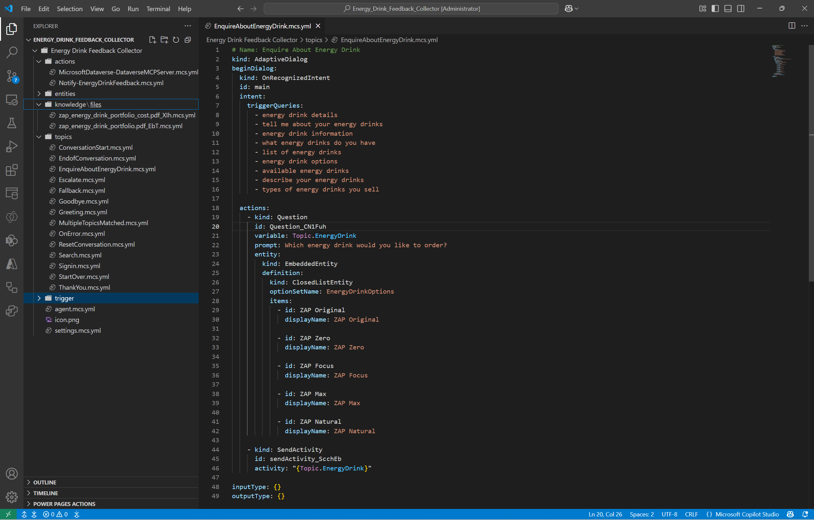

# AI-Powered Agent Optimizer for Microsoft Copilot Studio

**Automated YAML Optimization & Best Practice Enforcement using GitHub Copilot**

## 🎯 What is This?

Transform your Microsoft Copilot Studio agents from good to exceptional! This repository contains **AI-powered prompts** that automatically review and optimize your `.mcs.yml` files using **GitHub Copilot** directly in **Visual Studio Code**.

**In 30 seconds:** Add prompt context → Ask Copilot to analyze → Get optimized YAML → Apply improvements → Deploy better agents! 🚀

### ✨ Key Benefits
- ⚡ **Instant optimization** - Get improvements in seconds, not hours
- 🎯 **Microsoft-aligned** - Based on official best practices and documentation  
- 🔧 **VS Code integrated** - Works seamlessly with your existing workflow
- 🧠 **AI-powered** - Leverages GPT-4o, Claude Sonnet, and other advanced models
- 📊 **Component-specific** - Tailored prompts for each Copilot Studio component type

## ⚡ Quick Start Guide

### 0️⃣ **Prerequisites**
Before you begin, ensure you have:

1. **Visual Studio Code** installed
2. **Microsoft Copilot Studio Extension** for VS Code
   - Install from the [VS Code Marketplace](https://marketplace.visualstudio.com/items?itemName=ms-copilotstudio.vscode-copilotstudio)
   - Or search "Copilot Studio" in VS Code Extensions (`Ctrl+Shift+X`)
3. **GitHub Copilot** subscription (works with GPT-4o, Claude Sonnet, and other AI models)
4. **Microsoft Copilot Studio project** with `.mcs.yml` files


### 1️⃣ **Get This Repository**
First, you need to download this repository to access the prompt files:

#### **Option A: Clone with Git (Recommended)**
```bash
git clone https://github.com/[username]/copilot-studio-agent-optimizer.git
cd copilot-studio-agent-optimizer
```

#### **Option B: Download ZIP**
1. **Visit the GitHub repository page**
2. **Click "Code" → "Download ZIP"**
3. **Extract to your desired location**

#### **Option C: Open in VS Code directly**
```bash
# Clone and open in VS Code in one command
git clone https://github.com/[username]/copilot-studio-agent-optimizer.git && code copilot-studio-agent-optimizer
```

### 2️⃣ **Choose Your Component**
Pick the prompt file that matches your YAML component:
- `agent.mcs.yml` → Use [AgentConfiguration_BestPractices.md](./prompts/AgentConfiguration_BestPractices.md)
- `CustomTopic.mcs.yml` → Use [RegularTopics_BestPractices.md](./prompts/CustomTopics_BestPractices.md)
- `Fallback.mcs.yml` → Use [SystemTopics_BestPractices.md](./prompts/SystemTopics_BestPractices.md)
- `Search.mcs.yml` → Use [Knowledge_BestPractices.md](./prompts/Knowledge_BestPractices.md)
- And so on... ([see full reference table](#🔧-component-quick-reference))

### 3️⃣ **Add Context & Analyze in VS Code**

*Image placeholder: Animated GIF showing the add context → ask Copilot → get results workflow*

#### Step-by-Step Instructions:

1. **Open your Copilot Studio project** in VS Code
   
   *Image placeholder: Screenshot of VS Code with Copilot Studio project structure showing various .mcs.yml files*

2. **Select the YAML file** you want to optimize (e.g., `Fallback.mcs.yml`, `agent.mcs.yml`)

3. **Open GitHub Copilot Chat** (`Ctrl+Shift+I` or click the chat icon)
   
   *Image placeholder: Screenshot of Copilot Chat interface in VS Code*

4. **Add context sources** by clicking the "Add context" button (📎):
   
   *Image placeholder: Screenshot showing the Add Context button and file selection*
   
   - **Select the relevant prompt file** from this repository (e.g., `copilot-studio-agent-optimizer/prompts/RegularTopics_BestPractices.md`)
   - **Add `@workspace`** to include your Copilot Studio project context
   - **Optionally add your specific YAML file** for direct reference

5. **Ask Copilot to analyze** with a simple instruction:
   ```
   Example prompts:
   "Analyze my CustomOrderStatus.mcs.yml topic using the best practices guidelines"
   
   "Review this RegularTopic and suggest improvements following Microsoft standards"
   
   "Optimize my Fallback.mcs.yml based on the provided best practices"
   ```

6. **Review AI suggestions** and apply improvements directly in your YAML file

#### Pro Tips:
- **Use multiple context sources** - Add both the prompt file from this repository AND @workspace for comprehensive analysis
- **Keep both repositories open** - Have this repository and your Copilot Studio project both accessible in VS Code
- **Be specific in your request** - Reference the exact YAML file you want analyzed
- **Apply changes incrementally** - Test each improvement before moving to the next
- **Leverage YAML validation** - VS Code will highlight syntax errors immediately
- **Ask follow-up questions** - The context remains available throughout the conversation

### 4️⃣ **See the Transformation**

#### RegularTopic Before vs After Example

**Before Optimization - Poor Topic Structure:**

*Image placeholder: Screenshot of a poorly structured RegularTopic.mcs.yml with minimal trigger phrases, basic responses, and no entity usage*

**After Optimization - Enhanced Topic Structure:**

*Image placeholder: Screenshot of optimized RegularTopic.mcs.yml with 5-10 varied trigger phrases, conversational responses, proper entity integration, and clear conversation flow*

#### Key Improvements Demonstrated:
- **Trigger Phrases:** Expanded from 2-3 basic phrases to 5-10 natural variations
- **Conversation Design:** Enhanced from simple Q&A to engaging dialogue
- **Entity Integration:** Added proper slot filling and entity validation
- **Error Handling:** Improved fallback responses and user guidance
- **Response Quality:** More conversational and contextually appropriate responses

### 5️⃣ **Experience the Difference**

#### End User Conversation Quality

**Before Optimization - Basic Interaction:**

*Image placeholder: Chat showing user struggling to trigger the topic, agent giving robotic responses*

**After Optimization - Natural Conversation:**

*Image placeholder: Chat showing smooth topic recognition, engaging responses, and helpful follow-up questions*

#### Specific Improvement Example (RegularTopic):

**Topic Recognition:**
- ❌ **Before:** Limited trigger phrases may miss user intents: "I want to check my order status", "Check order status"
- ✅ **After:** Comprehensive trigger coverage with 5-10 varied phrases: "Where's my order?", "Can you help me track my package?", "My delivery status please", "What's the status of my shipment?", "Track my order"

**Response Quality:**
- ❌ **Before:** "Your order status is: [order_status]"
- ✅ **After:** "I found your order! Here's the current status: [order_status]. Would you like me to explain what this means or help you with anything else regarding your order?"

#### Developer Benefits:
- ⚡ **5-10 minutes** to optimize each topic (vs hours of manual review)
- 🎯 **Better user satisfaction** through improved conversation quality
- 📊 **Higher intent recognition** rates with optimized trigger phrases

---

## 📋 Available Prompts

## 📋 Available Prompts

### 1. 📝 [System Topics](./prompts/SystemTopics_BestPractices.md)
**Use for:** Fallback, Greeting, Goodbye, ConversationStart, EndofConversation, etc.
- System trigger configuration
- Conversation flow logic
- User experience design
- Error handling patterns

### 2. 🎯 [Triggers & Intent Recognition](./prompts/Triggers_BestPractices.md)
**Use for:** Topic trigger phrases and intent configuration
- Trigger phrase optimization (5-10 varied phrases)
- Natural language understanding
- Topic overlap prevention
- Intent recognition effectiveness

### 3. 💬 [Regular Topics](./prompts/RegularTopics_BestPractices.md)
**Use for:** Custom business logic topics
- Topic structure and organization
- Conversational design
- Entity usage and slot filling
- Integration with other components

### 4. 🧠 [Knowledge & Search](./prompts/Knowledge_BestPractices.md)
**Use for:** Search.mcs.yml and knowledge integration
- SearchAndSummarizeContent configuration
- Knowledge source integration
- Response quality optimization
- Performance considerations

### 5. ⚙️ [Actions & Power Automate](./prompts/Actions_BestPractices.md)
**Use for:** External service integrations and automations
- Connection configuration
- Input/output mapping
- Error handling and security
- User experience during execution

### 6. 🌐 [Bot Settings & Configuration](./prompts/BotSettings_BestPractices.md)
**Use for:** settings.mcs.yml and bot-level configuration
- Authentication and security
- AI settings optimization
- Feature enablement
- Performance configuration

### 7. 🔄 [Conversation Management](./prompts/ConversationManagement_BestPractices.md)
**Use for:** StartOver, Reset, state management topics
- User confirmation flows
- State management
- Variable cleanup
- Dialog control

### 8. 🤖 [Agent Configuration](./prompts/AgentConfiguration_BestPractices.md)
**Use for:** agent.mcs.yml and GPT agent behavior configuration
- Agent instructions and behavior
- Conversation starters optimization
- GPT capabilities configuration
- Agent personality and tone

### 9. 🏷️ [Entities & Data Types](./prompts/Entities_BestPractices.md)
**Use for:** entities/*.mcs.yml and data type definitions
- Entity type selection and configuration
- Value definitions and synonyms
- Smart matching optimization
- Slot filling integration

## 🚀 How to Use These Prompts

### Intended Workflow with Visual Studio Code + GitHub Copilot

These prompts are designed to be used with the **Copilot Studio Extensions** in **Visual Studio Code** along with **GitHub Copilot** to automatically analyze and improve your Microsoft Copilot Studio YAML files based on official best practices.

#### Recommended Setup:
1. **Visual Studio Code** with Copilot Studio Extensions installed
2. **GitHub Copilot** with your preferred AI model (GPT-4o, Claude Sonnet, etc.)
3. **Open your Copilot Studio project** containing .mcs.yml files

#### Usage Steps:
1. **Open the relevant YAML file** in VS Code (e.g., `Fallback.mcs.yml`, `agent.mcs.yml`)
2. **Open GitHub Copilot Chat** (`Ctrl+Shift+I`)
3. **Add context sources** using the "Add context" button (📎):
   - Select the appropriate prompt file from the `prompts/` folder
   - Add `@workspace` for project context
4. **Ask for analysis** with a simple instruction like "Analyze this YAML file using the best practices guidelines"
5. **Review the AI-generated improvements** that follow Microsoft best practices
6. **Apply suggested changes** directly in VS Code with Copilot's assistance

#### Example Workflow:
```
1. Open Fallback.mcs.yml in VS Code
2. Open GitHub Copilot Chat (Ctrl+Shift+I)
3. Click "Add context" → Select prompts/SystemTopics_BestPractices.md
4. Add @workspace for full project context
5. Ask: "Analyze my Fallback.mcs.yml using the best practices guidelines"
6. Review AI suggestions for improvements
7. Apply changes with Copilot's code assistance
```

### Alternative: Copy-Paste Method:
If you prefer the traditional approach:
1. **Copy the prompt** from the relevant component file
2. **Paste the prompt** in Copilot Chat
3. **Reference your YAML file** using `@workspace/filename.mcs.yml`
4. **Review suggestions** and apply improvements manually

## 🎯 Why Use These Prompts with VS Code + GitHub Copilot?

### **Intelligent Code Analysis**
- **Context-aware suggestions** - AI models understand your entire project structure and relationships between YAML files
- **Real-time validation** - Get immediate feedback on best practice compliance while editing
- **Pattern recognition** - AI identifies common anti-patterns and suggests proven solutions

### **Seamless Development Experience**
- **In-editor assistance** - No need to switch between tools or copy/paste between applications
- **Project-aware recommendations** - Suggestions consider your specific bot configuration and existing topics
- **Automated improvements** - AI can directly suggest code changes with proper YAML formatting

### **Best Practice Enforcement**
- **Microsoft-aligned guidance** - All prompts based on official Microsoft Learn documentation
- **Consistent quality** - Ensure all team members follow the same standards
- **Continuous improvement** - Regular analysis helps maintain code quality over time

## 📚 Based on Official Microsoft Guidelines

All prompts are created based on official Microsoft Learn documentation:
- [Topic Authoring Best Practices](https://learn.microsoft.com/en-us/microsoft-copilot-studio/guidance/topic-authoring-best-practices)
- [Trigger Phrases Best Practices](https://learn.microsoft.com/en-us/microsoft-copilot-studio/guidance/trigger-phrases-best-practices)
- [Fallback Topic Guidelines](https://learn.microsoft.com/en-us/microsoft-copilot-studio/guidance/fallback-topic)
- [System Topics](https://learn.microsoft.com/en-us/microsoft-copilot-studio/authoring-system-topics)
- [Configuration Fundamentals](https://learn.microsoft.com/en-us/microsoft-copilot-studio/configuration-fundamentals)

## ⚠️ Important Notes

- **Integrate with VS Code workflow** - Use these prompts within your existing Copilot Studio development environment
- **Leverage AI assistance** - GitHub Copilot's AI models provide context-aware suggestions based on your project structure
- **Preserve YAML structure** - Prompts focus on improvements within existing framework
- **Maintain IDs and references** - Keep topic and action connections intact
- **Follow security guidelines** - Ensure proper authentication and access control
- **Test changes thoroughly** - Validate improvements in test environment first
- **Use VS Code extensions** - Take advantage of YAML validation and Copilot Studio tooling

## 🔧 Component Quick Reference

| Component Type | File Pattern | Prompt File |
|---|---|---|
| System Topics | `Fallback.mcs.yml`, `Greeting.mcs.yml` | [SystemTopics_BestPractices.md](./prompts/SystemTopics_BestPractices.md) |
| Regular Topics | `EnquireAbout*.mcs.yml`, custom topics | [RegularTopics_BestPractices.md](./prompts/RegularTopics_BestPractices.md) |
| Knowledge | `Search.mcs.yml` | [Knowledge_BestPractices.md](./prompts/Knowledge_BestPractices.md) |
| Actions | `actions/*.mcs.yml` | [Actions_BestPractices.md](./prompts/Actions_BestPractices.md) |
| Settings | `settings.mcs.yml` | [BotSettings_BestPractices.md](./prompts/BotSettings_BestPractices.md) |
| Conversation Mgmt | `StartOver.mcs.yml`, `ResetConversation.mcs.yml` | [ConversationManagement_BestPractices.md](./prompts/ConversationManagement_BestPractices.md) |
| Agent Config | `agent.mcs.yml` | [AgentConfiguration_BestPractices.md](./prompts/AgentConfiguration_BestPractices.md) |
| Entities | `entities/*.mcs.yml` | [Entities_BestPractices.md](./prompts/Entities_BestPractices.md) |

Each prompt is standalone and can be used independently for focused component analysis and improvement.
