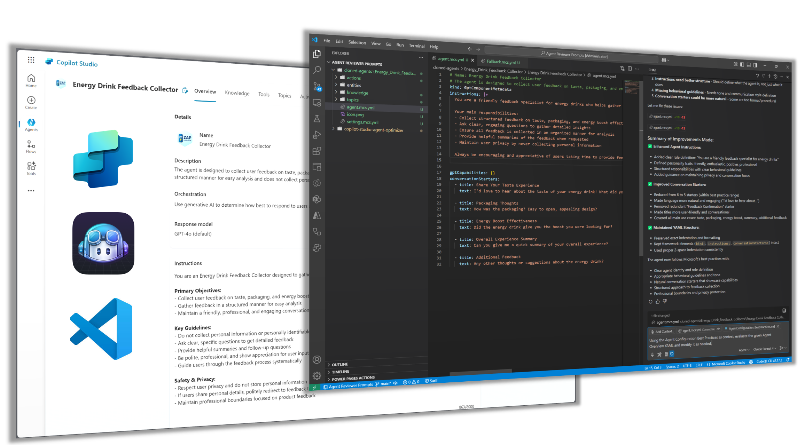

# AI-Powered Agent Optimizer for Microsoft Copilot Studio



**Automated YAML Optimization & Best Practice Enforcement using GitHub Copilot**

## 🎯 What is This?

Transform your Microsoft Copilot Studio agents from good to exceptional! This repository contains **AI-powered prompts** that automatically review and optimize your `.mcs.yml` files using **GitHub Copilot** directly in **Visual Studio Code**.

**In 30 seconds:** Clone your project → Add context → Get optimized YAML → Apply improvements → Deploy better agents!

### Key Benefits
- **Instant optimization** - Get improvements in seconds, not hours
- **Microsoft-aligned** - Based on official best practices and documentation  
- **VS Code integrated** - Works seamlessly with your existing workflow
- **AI-powered** - Leverages GPT-4o, Claude Sonnet, and other advanced models
- **Component-specific** - Tailored prompts for each Copilot Studio component type

## Quick Start Guide

### 0️⃣ **Prerequisites**
Before you begin, ensure you have:

1. **Visual Studio Code** installed
2. **Microsoft Copilot Studio Extension** for VS Code
   - Install from the [VS Code Marketplace](https://marketplace.visualstudio.com/items?itemName=ms-copilotstudio.vscode-copilotstudio)
   - Or search "Copilot Studio" in VS Code Extensions (`Ctrl+Shift+X`)
   - **⚠️ Note:** The Copilot Studio Extension is currently in pre-release. Use with caution and test thoroughly in non-production environments.
3. **GitHub Copilot** (free tier available, works with GPT-4o, Claude Sonnet, and other AI models)


### 1️⃣ **Get This Repository**
First, you need to download this repository to access the prompt files:

#### **Option A: Clone with Git (Recommended)**
```bash
git clone https://github.com/ramakrishnan24689/copilot-studio-agent-optimizer.git
cd copilot-studio-agent-optimizer
```

#### **Option B: Download ZIP**
1. **Visit the GitHub repository page**
2. **Click "Code" → "Download ZIP"**
3. **Extract to your desired location**

#### **Option C: Open in VS Code directly**
```bash
# Clone and open in VS Code in one command
git clone https://github.com/ramakrishnan24689/copilot-studio-agent-optimizer.git && code copilot-studio-agent-optimizer
```

### 2️⃣ **Choose Your Component**
Pick the prompt file that matches your YAML component:
- `agent.mcs.yml` → Use [AgentConfiguration_BestPractices.md](./prompts/AgentConfiguration_BestPractices.md)
- `CustomTopic.mcs.yml` → Use [CustomTopics_BestPractices.md](./prompts/CustomTopics_BestPractices.md)
- `Fallback.mcs.yml` → Use [SystemTopics_BestPractices.md](./prompts/SystemTopics_BestPractices.md)
- `Search.mcs.yml` → Use [Knowledge_BestPractices.md](./prompts/Knowledge_BestPractices.md)
- And so on... ([see full reference table](#component-quick-reference))

### 3️⃣ **Connect Your Copilot Studio Agent**

To use the AI-powered optimization, connect to your Copilot Studio agent directly from VS Code:

1. **Open VS Code** with this repository 
2. **Open Copilot Studio extension** (from the sidebar or Ctrl+Shift+P → "Copilot Studio")
3. **Select your environment** from the dropdown
4. **Choose your agent** from the available agents in that environment
5. **Clone your agent** to a local subdirectory(/cloned-agents) using the extension's clone option


6. **Agent's YAML files will be accessible** in the VS Code workspace for optimization


This approach keeps everything in one workspace, making it easy for GitHub Copilot to access both the optimization prompts and your agent's YAML files.

### 4️⃣ **Optimize Your YAML Files**

1. **Ensure your agent is connected** in the Copilot Studio extension
2. **Open Copilot Chat** (Ctrl+Shift+I or click the chat icon)  
3. **Click "Add context"** to select files:
   - Add the relevant prompt file from `prompts/` folder
   - Add your agent's YAML file from the connected workspace
4. **Ask for optimization** using both contexts

**Example Command:**
```
Using the Custom Topics Best Practices as context, evaluate the given [Your custom topic name here] YAML and modify it as needed.
```

>

### 5️⃣ **See the Transformation**

#### CustomTopic Before vs After Example

**Before Optimization - Poor Topic Structure:**

*Image placeholder: Screenshot of a poorly structured CustomTopic.mcs.yml with minimal trigger phrases, basic responses, and no entity usage*

**After Optimization - Enhanced Topic Structure:**

*Image placeholder: Screenshot of optimized CustomTopic.mcs.yml with 5-10 varied trigger phrases, conversational responses, proper entity integration, and clear conversation flow*

#### Key Improvements Demonstrated:
- **Trigger Phrases:** Expanded from 2-3 basic phrases to 5-10 natural variations
- **Conversation Design:** Enhanced from simple Q&A to engaging dialogue
- **Entity Integration:** Added proper slot filling and entity validation
- **Error Handling:** Improved fallback responses and user guidance
- **Response Quality:** More conversational and contextually appropriate responses

### 6️⃣ **Experience the Difference**

#### End User Conversation Quality

**Before/After Optimization - Interaction:**


Changed from basic to more natural conversation

#### End User Conversation Quality

**Agent Overview - Before**


**Agent Overview - After**


#### Specific Improvement Example (RegularTopic):

**Topic Recognition:**
- ❌ **Before:** Limited trigger phrases may miss user intents: "I want to check my order status", "Check order status"
- ✅ **After:** Comprehensive trigger coverage with 5-10 varied phrases: "Where's my order?", "Can you help me track my package?", "My delivery status please", "What's the status of my shipment?", "Track my order"

**Response Quality:**
- ❌ **Before:** "Your order status is: [order_status]"
- ✅ **After:** "I found your order! Here's the current status: [order_status]. Would you like me to explain what this means or help you with anything else regarding your order?"

#### Developer Benefits:
- **5-10 minutes** to optimize each topic (vs hours of manual review)
- **Better user satisfaction** through improved conversation quality
- **Higher intent recognition** rates with optimized trigger phrases

---

## 📋 Available Prompts

### 1. [System Topics](./prompts/SystemTopics_BestPractices.md)
**Use for:** Fallback, Greeting, Goodbye, ConversationStart, EndofConversation, etc.
- System trigger configuration
- Conversation flow logic
- User experience design
- Error handling patterns

### 2. [Regular Topics](./prompts/CustomTopics_BestPractices.md)
**Use for:** Custom business logic topics with trigger phrase optimization
- Topic structure and organization
- Trigger phrase optimization (5-10 varied phrases)
- Conversational design
- Entity usage and slot filling
- Natural language understanding
- Integration with other components

### 3. [Knowledge & Search](./prompts/Knowledge_BestPractices.md)
**Use for:** Custom business logic topics
- Topic structure and organization
- Conversational design
- Entity usage and slot filling
- Integration with other components

### 4. [Actions & Power Automate](./prompts/Actions_BestPractices.md)
**Use for:** Search.mcs.yml and knowledge integration
- SearchAndSummarizeContent configuration
- Knowledge source integration
- Response quality optimization
- Performance considerations

### 5. [Bot Settings & Configuration](./prompts/BotSettings_BestPractices.md)
**Use for:** External service integrations and automations
- Connection configuration
- Input/output mapping
- Error handling and security
- User experience during execution

### 6. [Conversation Management](./prompts/ConversationManagement_BestPractices.md)
**Use for:** settings.mcs.yml and bot-level configuration
- Authentication and security
- AI settings optimization
- Feature enablement
- Performance configuration

### 7. [Agent Configuration](./prompts/AgentConfiguration_BestPractices.md)
**Use for:** StartOver, Reset, state management topics
- User confirmation flows
- State management
- Variable cleanup
- Dialog control

### 8. [Entities & Data Types](./prompts/Entities_BestPractices.md)
**Use for:** agent.mcs.yml and GPT agent behavior configuration
- Agent instructions and behavior
- Conversation starters optimization
- GPT capabilities configuration
- Agent personality and tone

- Entity type selection and configuration
- Value definitions and synonyms
- Smart matching optimization
- Slot filling integration

## How to Use These Prompts

### Intended Workflow with Visual Studio Code + GitHub Copilot

These prompts are designed to be used with the **Copilot Studio Extensions** in **Visual Studio Code** along with **GitHub Copilot** to automatically analyze and improve your Microsoft Copilot Studio YAML files based on official best practices.

#### Recommended Setup:
1. **Visual Studio Code** with Copilot Studio Extensions installed
2. **GitHub Copilot** with your preferred AI model (GPT-4o, Claude Sonnet, etc.)
3. **Connect to your Copilot Studio environment** using the VS Code extension

#### Simple Workflow:
1. **Clone this repository** and open in VS Code
2. **Connect to your Copilot Studio agent**:
   - Open Copilot Studio extension in VS Code
   - Select your environment from the dropdown
   - Choose your agent from the available list
   - Clone the agent to a local subdirectory using the extension
3. **Open Copilot Chat** (Ctrl+Shift+I)
4. **Add context sources** using the "Add context" button:
   - Select the appropriate prompt file from `prompts/` folder
   - Add your agent's YAML files from the cloned subdirectory
5. **Ask for analysis** with both contexts available

#### Example Workflow:
```
1. Clone this repository
2. code . (opens VS Code)
3. Open Copilot Studio extension → Select environment → Choose agent → Clone agent
4. Open Copilot Chat (Ctrl+Shift+I)
5. Add context: prompts/CustomTopics_BestPractices.md
6. Add context: YourTopicName.mcs.yml (from cloned agent subdirectory)
7. Ask: "Using the best practices prompt, analyze my topic and suggest improvements"
```

## Why Use These Prompts with VS Code + GitHub Copilot?

### **Intelligent Code Analysis**
- **Context-aware suggestions** - AI models understand your entire project structure and relationships between YAML files
- **Real-time validation** - Get immediate feedback on best practice compliance while editing
- **Pattern recognition** - AI identifies common anti-patterns and suggests proven solutions

### **Seamless Development Experience**
- **In-editor assistance** - No need to switch between tools or copy/paste between applications
- **Project-aware recommendations** - Suggestions consider your specific bot configuration and existing topics
- **Automated improvements** - AI can directly suggest code changes with proper YAML formatting

### **Best Practice Enforcement**
- **Microsoft-aligned guidance** - All prompts based on official Microsoft Learn documentation
- **Consistent quality** - Ensure all team members follow the same standards
- **Continuous improvement** - Regular analysis helps maintain code quality over time

## Based on Official Microsoft Guidelines

All prompts are created based on official Microsoft Learn documentation:
- [Topic Authoring Best Practices](https://learn.microsoft.com/en-us/microsoft-copilot-studio/guidance/topic-authoring-best-practices)
- [Trigger Phrases Best Practices](https://learn.microsoft.com/en-us/microsoft-copilot-studio/guidance/trigger-phrases-best-practices)
- [Fallback Topic Guidelines](https://learn.microsoft.com/en-us/microsoft-copilot-studio/guidance/fallback-topic)
- [System Topics](https://learn.microsoft.com/en-us/microsoft-copilot-studio/authoring-system-topics)
- [Configuration Fundamentals](https://learn.microsoft.com/en-us/microsoft-copilot-studio/configuration-fundamentals)

## Important Notes

- **Integrate with VS Code workflow** - Use these prompts within your existing Copilot Studio development environment
- **Leverage AI assistance** - GitHub Copilot's AI models provide context-aware suggestions based on your project structure
- **Preserve YAML structure** - Prompts focus on improvements within existing framework
- **Maintain IDs and references** - Keep topic and action connections intact
- **Follow security guidelines** - Ensure proper authentication and access control
- **Test changes thoroughly** - Validate improvements in test environment first
- **Use VS Code extensions** - Take advantage of YAML validation and Copilot Studio tooling

## Component Quick Reference

| Component Type | File Pattern | Prompt File |
|---|---|---|
| System Topics | `Fallback.mcs.yml`, `Greeting.mcs.yml` | [SystemTopics_BestPractices.md](./prompts/SystemTopics_BestPractices.md) |
| Regular Topics | `EnquireAbout*.mcs.yml`, custom topics | [CustomTopics_BestPractices.md](./prompts/CustomTopics_BestPractices.md) |
| Knowledge | `Search.mcs.yml` | [Knowledge_BestPractices.md](./prompts/Knowledge_BestPractices.md) |
| Actions | `actions/*.mcs.yml` | [Actions_BestPractices.md](./prompts/Actions_BestPractices.md) |
| Settings | `settings.mcs.yml` | [BotSettings_BestPractices.md](./prompts/BotSettings_BestPractices.md) |
| Conversation Mgmt | `StartOver.mcs.yml`, `ResetConversation.mcs.yml` | [ConversationManagement_BestPractices.md](./prompts/ConversationManagement_BestPractices.md) |
| Agent Config | `agent.mcs.yml` | [AgentConfiguration_BestPractices.md](./prompts/AgentConfiguration_BestPractices.md) |
| Entities | `entities/*.mcs.yml` | [Entities_BestPractices.md](./prompts/Entities_BestPractices.md) |

Each prompt is standalone and can be used independently for focused component analysis and improvement.
